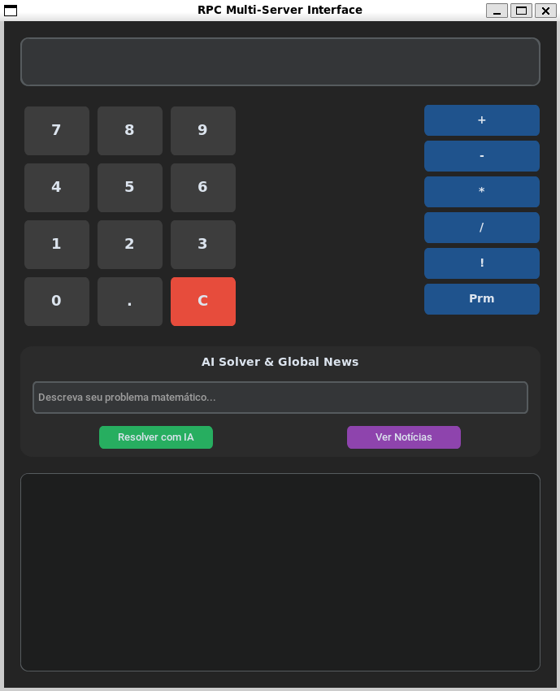

# 🔄 Sistema RPC Multi-Server - Remote Procedure Call

> Sistema distribuído desenvolvido em Python para execução remota de operações matemáticas com arquitetura de múltiplos servidores, Name Server (DNS), cache inteligente e uma interface de calculadora de hardware real integrada a um Solver de IA com Chain of Thought (CoT).

[](https://www.python.org/)
[](https://docs.python.org/3/library/socket.html)
[](https://ai.google.dev/)
[](https://customtkinter.tomschimansky.com/)
[](https://www.crummy.com/software/BeautifulSoup/)



---

## 📋 Sobre o Projeto

**Sistema RPC Multi-Server** é uma implementação avançada de Remote Procedure Call que distribui operações matemáticas entre múltiplos servidores especializados, com recursos de:

- 🌐 **Arquitetura Distribuída**: Name Server (DNS) para descoberta automática de servidores
- 🧮 **Operações Matemáticas**: Soma, subtração, multiplicação, divisão, fatorial e verificação de primos
- 🤖 **Solver de IA com CoT**: Resolução de problemas matemáticos em linguagem natural com raciocínio passo a passo (Google Gemini)
- 🖥️ **Interface "Real-Feel"**: GUI moderna simulando calculadora de hardware com lógica de acumulador e encadeamento de operações
- 💾 **Cache Multinível**: Cache em memória (cliente) e cache em disco (servidor)
- 🔄 **Processamento Paralelo**: Uso de multiprocessing para operações pesadas
- 📰 **Web Scraping**: Integração com notícias do UOL
- 🛡️ **Fallback**: Sistema funciona mesmo com servidor offline usando cache

> **Disciplina**: Sistemas Distribuídos  
> **Curso**: Sistemas para Internet  
> **Tipo**: Trabalho Individual - Atividades Semanais

---

## 🚀 Tecnologias

### Core
- **Python 3.8+** - Linguagem principal
- **Socket TCP/IP** - Comunicação cliente-servidor
- **Socket UDP** - Name Server (descoberta de serviços)
- **Multiprocessing** - Processamento paralelo
- **Threading** - Interface não-bloqueante

### Bibliotecas
- **CustomTkinter 5.2+** - Interface gráfica moderna
- **Google Generative AI** - Solver matemático com IA (Gemini 2.5 Flash)
- **BeautifulSoup4** - Web scraping de notícias
- **Requests** - Requisições HTTP
- **Python-dotenv** - Gerenciamento de variáveis de ambiente
- **JSON** - Serialização de dados e cache

---

## 📦 Pré-requisitos

- [Python 3.8+](https://www.python.org/downloads/)
- pip (gerenciador de pacotes Python)
- Chave de API do Google Gemini ([obter aqui](https://ai.google.dev/))

### Instalação das Dependências

```bash
pip install requests beautifulsoup4 customtkinter google-generativeai python-dotenv

ou

pip install -r requirements.txt
```

### Configuração da API do Google Gemini

1. Crie um arquivo `.env` na raiz do projeto:

```bash
GOOGLE_API_KEY=sua_chave_api_aqui
```

2. Obtenha sua chave gratuita em: https://ai.google.dev/

---

## 📁 Estrutura do Projeto

```
projeto/
├── client/                    # Lógica do Cliente 
│   ├── operations.py          # Interface RPC com decorators
│   ├── rpc_exception.py       # Exceções customizadas
│   ├── tcp_client.py          # Cliente TCP com cache em memória
│   └── teste_operacoes.py     # Script de testes
├── common/                    # Recursos compartilhados
│   └── enums.py               # Enumerações (comandos)
├── config/                    # Configurações
│   ├── cache_config.py        # Gerenciamento de cache
│   ├── config.py              # Carregador de configurações
│   └── configuracoes.txt      # Arquivo de configuração 
├── server/                    # Servidores de Operações
│   ├── math_operations.py     # Implementação das operações
│   ├── name_server.py         # Name Server (DNS) - UDP
│   ├── server1.py             # Servidor 1: Operações básicas
│   ├── server2.py             # Servidor 2: Teoria dos números
│   ├── server3.py             # Servidor 3: Solver IA + Notícias
│   └── cache_operations.json  # Cache persistente (gerado automaticamente)
├── gui_app.py                 # Interface gráfica (CustomTkinter)
├── README.md
└── requirements.txt
```

---

O arquivo `config/configuracoes.txt` contém as configurações do sistema:

```json
{
    "ip_name_server": "localhost",
    "port_name_server": 6777,

    "ip_server1": "localhost",
    "port_server1": 7677,
    
    "ip_server2": "localhost",
    "port_server2": 7767,

    "ip_server3": "localhost",
    "port_server3": 7776,

    "max_cache_size": 10000,
    "cache_expiration": 1
}
```

### Parâmetros

| Parâmetro | Tipo | Descrição |
|-----------|------|-----------|
| `ip_name_server` | string | Endereço IP do Name Server (DNS) |
| `port_name_server` | int | Porta UDP do Name Server |
| `ip_server1` | string | IP do Servidor 1 (operações básicas) |
| `port_server1` | int | Porta TCP do Servidor 1 |
| `ip_server2` | string | IP do Servidor 2 (teoria dos números) |
| `port_server2` | int | Porta TCP do Servidor 2 |
| `ip_server3` | string | IP do Servidor 3 (solver + notícias) |
| `port_server3` | int | Porta TCP do Servidor 3 |
| `max_cache_size` | int | Tamanho máximo do cache em bytes |
| `cache_expiration` | int | Tempo de expiração do cache em minutos |

---

## 🎯 Funcionalidades Principais

### 1. Interface "Real-Feel" & UX Aprimorada

A interface foi completamente reconstruída para operar como uma calculadora de hardware real.

#### ⚡ Interface Assíncrona (Multithreading)
- **Chamadas Não-Bloqueantes**: Todas as operações RPC são executadas em threads separadas
- **UI Responsiva**: A interface nunca "congela" enquanto aguarda resposta do servidor
- **Feedback Visual**: Logs em tempo real das operações sendo executadas
- **Experiência Fluida**: O usuário pode continuar interagindo com a interface mesmo durante operações pesadas

```python
# Exemplo de chamada assíncrona
def _execute_calc(self, next_op=None):
    def task():
        try:
            res = self.pending_operator(val1, val2)
            self.root.after(0, lambda: self._update_ui_after_rpc(res, next_op))
        except Exception as e:
            self.root.after(0, lambda: messagebox.showerror("Erro RPC", str(e)))
    
    threading.Thread(target=task, daemon=True).start()
```

**Recursos da GUI:**
- ✨ Tema dark moderno
- 🧮 Calculadora com lógica de acumulador
- 🔢 Operações básicas e avançadas (fatorial, primo)
- ⛓️ Encadeamento de operações contínuas
- ⚡ Interface assíncrona não-bloqueante
- 🤖 Campo para Solver de IA com CoT
- 💡 Dica visual sobre complexidade de operações
- 📰 Botão para buscar notícias atualizadas
- 📜 Área de logs em tempo real

### 2. Arquitetura Multi-Server com Name Server (DNS)

```
┌─────────────────┐         ┌─────────────────┐
│     Cliente     │◄───UDP──┤  Name Server    │
│   (operations)  │         │   (DNS:5000)    │
└────────┬────────┘         └─────────────────┘
         │                           │
         │         Consulta: "sum"   │
         │──────────────────────────►│
         │                           │
         │      {ip: "127.0.0.1",    │
         │◄──────port: 5001}─────────│
         │                           
         ▼ TCP                        
┌─────────────────┐  ┌─────────────────┐  ┌─────────────────┐
│   Server 1      │  │   Server 2      │  │   Server 3      │
│   :5001         │  │   :5002         │  │   :5003         │
│                 │  │                 │  │                 │
│ • sum           │  │ • fat           │  │ • solver (IA)   │
│ • sub           │  │ • prim          │  │ • news          │
│ • prod          │  │                 │  │                 │
│ • div           │  │                 │  │                 │
└─────────────────┘  └─────────────────┘  └─────────────────┘
```

**Fluxo de Operação:**
1. Cliente pergunta ao Name Server: "Quem processa 'sum'?"
2. Name Server responde: "Servidor 1 em 127.0.0.1:5001"
3. Cliente conecta diretamente ao Servidor 1 via TCP
4. Servidor 1 processa e retorna resultado

### 3. Sistema de Cache Multinível

#### Cache em Memória (Cliente)
```python
# Armazena respostas recentes com timestamp
operations_cache = {
    'sum 5 2': {
        'response': 7.0,
        'timestamp': '2025-11-30T10:30:00'
    }
}
```

#### Cache em Disco (Servidor)
```python
# Persiste operações com gerenciamento de tamanho
def enforce_cache_limit(cache, file, max_size, new_key, new_value):
    # Remove entradas antigas se necessário (FIFO)
    # Valida tamanho antes de adicionar
    # Retorna True se adicionado com sucesso
```

### 4. Operações Matemáticas

#### Operações Básicas (Servidor 1)
```python
op = Operations()

# Soma de múltiplos números
result = op.sum(5, 2, 3, 1)  # 11.0

# Subtração sequencial
result = op.sub(10, 2, 3)    # 5.0

# Produto
result = op.prod(2, 3, 4)    # 24.0

# Divisão
result = op.div(100, 2, 5)   # 10.0
```

#### Teoria dos Números (Servidor 2)
```python
# Fatorial
result = op.fat(5)  # 120

# Verificação de Primos (Multiprocessing)
numbers = [2, 3, 4, 5, 17, 20]
results = op.prim(*numbers)
# [True, True, False, True, True, False]
```

### 5. Solver de IA (CoT) com Google Gemini (Servidor 3)

```python
# Resolve problemas matemáticos em linguagem natural
result = op.solver("Calcule a raiz quadrada de 144")
# '12'

result = op.solver("Quanto é 15% de 200?")
# '30.0'

result = op.solver("Resolva: 2x + 5 = 15")
# '5'
```

**Implementação:**
```python
def math_problem_solver(problem: str) -> str:
    genai.configure(api_key=API_KEY)
    model = genai.GenerativeModel('gemini-2.5-flash')
    
    # Prompt estruturado para CoT
    prompt = f"""
    Você é um serviço de resolução de problemas matemáticos.
    
    TAREFA:
    1. Responde APENAS em JSON.
    2. Analise se o texto abaixo descreve um problema matemático válido.
    3. Se for válido, explique o raciocínio passo a passo.
    
    FORMATO DE RESPOSTA (JSON VÁLIDO):
    {{
        "erro": false,
        "raciocínio": ["passo 1", "passo 2", ...],
        "resultado": 
    }}
    
    Texto: {problem}
    """
    
    response = model.generate_content(prompt)
    # Processa JSON e retorna resultado
    return str(data.get('resultado'))
```

### 6. Web Scraping de Notícias (Servidor 3)

```python
# Busca as 5 principais manchetes do UOL
news = op.news()

# Exemplo de saída:
# [
#   "Governo anuncia novo pacote econômico",
#   "Brasil vence competição internacional",
#   ...
# ]
```

---

## 💻 Como Usar

### 1️⃣ Iniciar o Name Server (DNS)

```bash
python name_server.py
```

**Saída esperada:**
```
Name Server UDP escutando em 127.0.0.1:5000
Servidores registrados: 3
--------------------------------------------------
```

### 2️⃣ Iniciar os Servidores de Operações

**Terminal 1 - Servidor 1 (Operações Básicas):**
```bash
python server1.py
```

**Terminal 2 - Servidor 2 (Teoria dos Números):**
```bash
python server2.py
```

**Terminal 3 - Servidor 3 (Solver IA + Notícias):**
```bash
python server3.py
```

### 3️⃣ Executar a Interface Gráfica

```bash
cd client
python gui_app.py
```

### 4️⃣ Usar a Calculadora

#### Operações Simples:
1. Digite o primeiro número usando os botões numéricos
2. Pressione o operador (+, -, *, /)
3. Digite o segundo número
4. Pressione "=" para ver o resultado

#### Encadeamento de Operações:
1. `10` → `+` → `5` → `-` (resolve 10+5 automaticamente) → `3` → `=`
2. A interface mantém o resultado acumulado e permite continuar calculando

#### Operações Avançadas:
- `!` (fatorial): Digite um número e pressione "!"
- `?` (primo): Digite um número e pressione "?"

#### Solver de IA:
Para expressões complexas (ex: "raiz quadrada de 144", "(10+5)*2", "30% de 200"):
1. Digite a expressão no campo "IA Solver"
2. Clique em "Resolver com IA"
3. Veja o resultado e o raciocínio passo a passo nos logs

### 5️⃣ Usar a API em Seu Código

```python
from client.operations import Operations

# Inicializa cliente (conecta ao Name Server)
op = Operations()

# Operações básicas
print(op.sum(10, 20, 30))        # 60.0
print(op.prod(5, 4))             # 20.0
print(op.fat(10))                # 3628800

# Verificar primos (paralelo)
numeros = [2, 3, 4, 5, 17, 19, 20]
primos = op.prim(*numeros)
print(primos)  # [True, True, False, True, True, True, False]

# Solver de IA com CoT
resultado = op.solver("Calcule a raiz cúbica de 27")
print(resultado)  # '3' (com raciocínio passo a passo no servidor)

# Buscar notícias
noticias = op.news()
for i, noticia in enumerate(noticias, 1):
    print(f"{i}. {noticia}")
```

---

## 🏗️ Arquitetura do Sistema

O sistema segue o modelo de camadas para garantir escalabilidade:

1. **Client (GUI/Operations)**: Captura a intenção do usuário e gerencia a lógica de acumulador
2. **Name Server (DNS)**: Atua como o "Páginas Amarelas" do sistema, mapeando operações para `IP:Porta`
3. **Servers (Workers)**: Executam o processamento pesado e retornam os dados via sockets TCP

### Fluxo Completo de uma Operação

```
┌──────────────────────────────────────────────────────────────┐
│                         CLIENTE                              │
│                                                              │
│  1. Usuário pressiona: 10 + 5                                │
│     ↓                                                        │
│  2. Armazena: stored_value=10, pending_operator=sum          │
│     ↓                                                        │
│  3. Usuário pressiona: -                                     │
│     ↓                                                        │
│  4. Executa pendente em thread: sum(10, 5)                   │
│     ↓                                                        │
│  5. Verifica cache em memória (expirado?)                    │
│     ↓ [MISS]                                                 │
│  6. Consulta Name Server via UDP: "sum"                      │
└──────────────────────┬───────────────────────────────────────┘
                       │ UDP
                       ▼
┌──────────────────────────────────────────────────────────────┐
│                     NAME SERVER (DNS)                        │
│                                                              │
│  7. Busca em dicionário: servers["server1"]["operations"]    │
│     ↓                                                        │
│  8. Retorna: {"server_ip": "127.0.0.1", "port": 5001}        │
└──────────────────────┬───────────────────────────────────────┘
                       │ UDP Response
                       ▼
┌──────────────────────────────────────────────────────────────┐
│                         CLIENTE                              │
│                                                              │
│  9. Recebe IP e porta do servidor responsável                │
│     ↓                                                        │
│ 10. Conecta via TCP ao servidor específico                   │
└──────────────────────┬───────────────────────────────────────┘
                       │ TCP: "sum 10 5"
                       ▼
┌──────────────────────────────────────────────────────────────┐
│                       SERVIDOR 1                             │
│                                                              │
│ 11. Verifica cache em disco                                  │
│     ↓ [MISS]                                                 │
│ 12. Executa: basic_operations("sum 10 5")                    │
│     ↓                                                        │
│ 13. Salva no cache: {"sum 10 5": 15.0}                       │
│     ↓                                                        │
│ 14. Retorna resultado: 15.0                                  │
└──────────────────────┬───────────────────────────────────────┘
                       │ TCP Response
                       ▼
┌──────────────────────────────────────────────────────────────┐
│                         CLIENTE                              │
│                                                              │
│ 15. Thread atualiza UI via root.after()                      │
│ 16. Salva no cache em memória com timestamp                  │
│ 17. Atualiza visor: 15                                       │
│ 18. Prepara próximo operador: pending_operator=sub           │
└──────────────────────────────────────────────────────────────┘
```

### Distribuição de Servidores

| Servidor | Porta | Operações | Tecnologia |
|----------|-------|-----------|------------|
| **Name Server** | 5000 (UDP) | Descoberta de serviços | Socket UDP |
| **Server 1** | 5001 (TCP) | sum, sub, prod, div | Aritmética básica |
| **Server 2** | 5002 (TCP) | fat, prim | Multiprocessing |
| **Server 3** | 5003 (TCP) | solver, news | Google Gemini + BeautifulSoup |

---

## 🔒 Recursos de Segurança e Confiabilidade

### 1. Tratamento de Erros
- ✅ Validação de divisão por zero
- ✅ Validação de fatorial para números negativos
- ✅ Try-catch em operações de I/O e rede
- ✅ Verificação de disponibilidade do servidor
- ✅ Validação de entrada do Solver de IA (JSON parsing robusto)
- ✅ Thread-safety nas atualizações de UI

### 2. Gerenciamento de Cache
- ✅ Limite de tamanho configurável
- ✅ Política FIFO para remoção
- ✅ Expiração por tempo (cliente)
- ✅ Fallback para cache em disco se servidor offline
- ✅ Validação de tamanho antes de adicionar

### 3. Performance
- ✅ Interface assíncrona (threading) - UI nunca bloqueia
- ✅ Processamento paralelo para verificação de primos (4 processos)
- ✅ Suporte a números grandes (até 1.000.000 dígitos)
- ✅ Cache multinível (memória + disco)
- ✅ Reutilização de conexões socket
- ✅ Descoberta dinâmica de servidores via DNS

### 4. Escalabilidade
- ✅ Arquitetura distribuída permite adicionar novos servidores
- ✅ Name Server centraliza configuração
- ✅ Cada servidor pode ser executado em máquina diferente
- ✅ Load balancing implícito (um servidor por tipo de operação)

---

## 🤝 Contribuindo

Este é um projeto acadêmico, mas sugestões são bem-vindas:

1. Fork o projeto
2. Crie uma branch (`git checkout -b feature/MinhaFeature`)
3. Commit suas mudanças (`git commit -m 'Adiciona nova feature'`)
4. Push para a branch (`git push origin feature/MinhaFeature`)
5. Abra um Pull Request

---

## 📝 Licença

Este projeto é um trabalho acadêmico desenvolvido para a disciplina de **Sistemas Distribuídos** do curso de **Sistemas para Internet**.

---

## 👨‍💻 Autor

**[Hugo Vinícius Rodrigues Pereira]**

[](https://github.com/hugovrp)

---

## 📞 Suporte

Encontrou um bug ou tem uma sugestão? [Abra uma issue](https://github.com/hugovrp/TSI-RPC_RemoteProcedureCall/issues)
